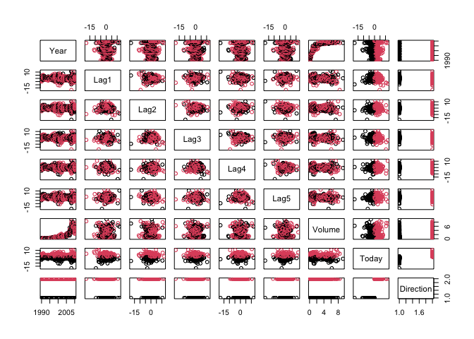

Solutions to Applied Questions — Chapter 4
================

``` r
# Load package ----------
library(ISLR2)
library(dplyr)
```

    ## 
    ## Attaching package: 'dplyr'

    ## The following objects are masked from 'package:stats':
    ## 
    ##     filter, lag

    ## The following objects are masked from 'package:base':
    ## 
    ##     intersect, setdiff, setequal, union

``` r
library(ggplot2)
```

# Questions 13

This question should be answered using the `Weekly` data set, which is
part of the `ISLR2` package. This data is similar in nature to the
`Smarket` data from this chapter’s lab, except that it contains 1,089
weekly returns for 21 years, from the beginning of 1990 to the end of
2010.

**a) Produce some numerical and graphical summaries of the `Weekly`
data. Do there appear to be any patterns?**

There appears to be an exponential relation between `Year` and `Volume`.
There is also a significance in the correlation between all the lags.
`Volume` appears significantly correlated with the other variables as
well, except possibly `Today` which is only significantly correlated
with `Lag1`, `Lag2`, and `Lag3`.

``` r
# Summaries ---------
summary(Weekly)
```

    ##       Year           Lag1               Lag2               Lag3         
    ##  Min.   :1990   Min.   :-18.1950   Min.   :-18.1950   Min.   :-18.1950  
    ##  1st Qu.:1995   1st Qu.: -1.1540   1st Qu.: -1.1540   1st Qu.: -1.1580  
    ##  Median :2000   Median :  0.2410   Median :  0.2410   Median :  0.2410  
    ##  Mean   :2000   Mean   :  0.1506   Mean   :  0.1511   Mean   :  0.1472  
    ##  3rd Qu.:2005   3rd Qu.:  1.4050   3rd Qu.:  1.4090   3rd Qu.:  1.4090  
    ##  Max.   :2010   Max.   : 12.0260   Max.   : 12.0260   Max.   : 12.0260  
    ##       Lag4               Lag5              Volume            Today         
    ##  Min.   :-18.1950   Min.   :-18.1950   Min.   :0.08747   Min.   :-18.1950  
    ##  1st Qu.: -1.1580   1st Qu.: -1.1660   1st Qu.:0.33202   1st Qu.: -1.1540  
    ##  Median :  0.2380   Median :  0.2340   Median :1.00268   Median :  0.2410  
    ##  Mean   :  0.1458   Mean   :  0.1399   Mean   :1.57462   Mean   :  0.1499  
    ##  3rd Qu.:  1.4090   3rd Qu.:  1.4050   3rd Qu.:2.05373   3rd Qu.:  1.4050  
    ##  Max.   : 12.0260   Max.   : 12.0260   Max.   :9.32821   Max.   : 12.0260  
    ##  Direction 
    ##  Down:484  
    ##  Up  :605  
    ##            
    ##            
    ##            
    ## 

``` r
Hmisc::rcorr(as.matrix(Weekly[,-9]))
```

    ##         Year  Lag1  Lag2  Lag3  Lag4  Lag5 Volume Today
    ## Year    1.00 -0.03 -0.03 -0.03 -0.03 -0.03   0.84 -0.03
    ## Lag1   -0.03  1.00 -0.07  0.06 -0.07 -0.01  -0.06 -0.08
    ## Lag2   -0.03 -0.07  1.00 -0.08  0.06 -0.07  -0.09  0.06
    ## Lag3   -0.03  0.06 -0.08  1.00 -0.08  0.06  -0.07 -0.07
    ## Lag4   -0.03 -0.07  0.06 -0.08  1.00 -0.08  -0.06 -0.01
    ## Lag5   -0.03 -0.01 -0.07  0.06 -0.08  1.00  -0.06  0.01
    ## Volume  0.84 -0.06 -0.09 -0.07 -0.06 -0.06   1.00 -0.03
    ## Today  -0.03 -0.08  0.06 -0.07 -0.01  0.01  -0.03  1.00
    ## 
    ## n= 1089 
    ## 
    ## 
    ## P
    ##        Year   Lag1   Lag2   Lag3   Lag4   Lag5   Volume Today 
    ## Year          0.2871 0.2709 0.3225 0.3048 0.3143 0.0000 0.2845
    ## Lag1   0.2871        0.0135 0.0531 0.0187 0.7874 0.0321 0.0133
    ## Lag2   0.2709 0.0135        0.0124 0.0541 0.0167 0.0047 0.0509
    ## Lag3   0.3225 0.0531 0.0124        0.0128 0.0454 0.0222 0.0187
    ## Lag4   0.3048 0.0187 0.0541 0.0128        0.0125 0.0439 0.7964
    ## Lag5   0.3143 0.7874 0.0167 0.0454 0.0125        0.0535 0.7166
    ## Volume 0.0000 0.0321 0.0047 0.0222 0.0439 0.0535        0.2754
    ## Today  0.2845 0.0133 0.0509 0.0187 0.7964 0.7166 0.2754

``` r
pairs(Weekly, col=Weekly$Direction)
```

<!-- -->

**(b) Use the full data set to perform a logistic regression with
`Direction` as the response and the five lag variables plus `Volume` as
predictors. Use the summary function to print the results. Do any of the
predictors appear to be statistically significant? If so, which ones?**

**(c) Compute the confusion matrix and overall fraction of correct
predictions. Explain what the confusion matrix is telling you about the
types of mistakes made by logistic regression.**

**(d) Now fit the logistic regression model using a training data period
from 1990 to 2008, with `Lag2` as the only predictor. Compute the
confusion matrix and the overall fraction of correct predictions for the
held out data (that is, the data from 2009 and 2010).**

**(e) Repeat (d) using LDA.**

**(f) Repeat (d) using QDA.**

**(g) Repeat (d) using KNN with K = 1.**

**(h) Repeat (d) using naive Bayes.**

**(i) Which of these methods appears to provide the best results on this
data?**

**(j) Experiment with different combinations of predictors, including
possible transformations and interactions, for each of the methods.
Report the variables, method, and associated confusion matrix that
appears to provide the best results on the held out data. Note that you
should also experiment with values for K in the KNN classifier.**
