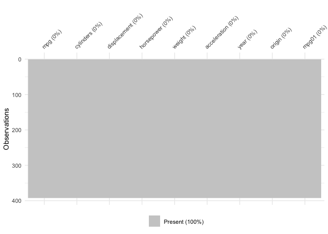
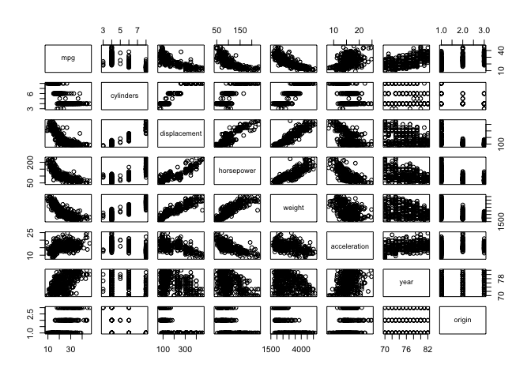
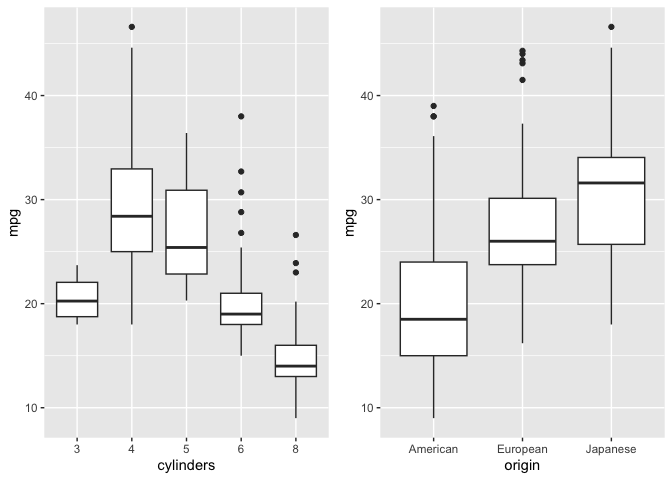
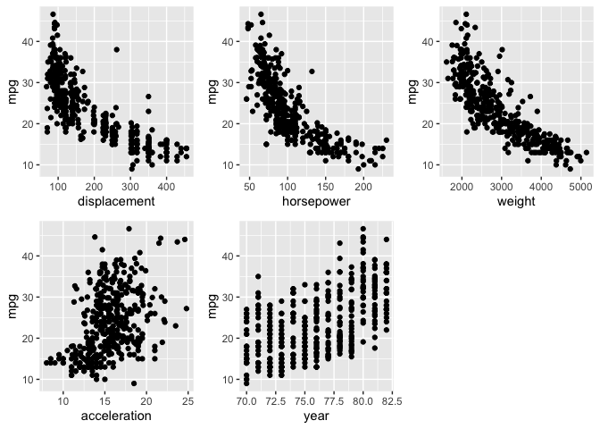

Solutions to Applied Questions — Chapter 4
================

``` r
library(ISLR2)
library(ISLR)
library(dplyr)
library(ggplot2)
```

# Questions 13

This question should be answered using the `Weekly` data set, which is
part of the `ISLR2` package. This data is similar in nature to the
`Smarket` data from this chapter’s lab, except that it contains 1,089
weekly returns for 21 years, from the beginning of 1990 to the end of
2010.

**a) Produce some numerical and graphical summaries of the `Weekly`
data. Do there appear to be any patterns?**

There appears to be an exponential relation between `Year` and `Volume`.
There is also a significance in the correlation between all the lags.
`Volume` appears significantly correlated with the other variables as
well, except possibly `Today` which is only significantly correlated
with `Lag1`, `Lag2`, and `Lag3`.

``` r
summary(Weekly)
```

    ##       Year           Lag1               Lag2               Lag3         
    ##  Min.   :1990   Min.   :-18.1950   Min.   :-18.1950   Min.   :-18.1950  
    ##  1st Qu.:1995   1st Qu.: -1.1540   1st Qu.: -1.1540   1st Qu.: -1.1580  
    ##  Median :2000   Median :  0.2410   Median :  0.2410   Median :  0.2410  
    ##  Mean   :2000   Mean   :  0.1506   Mean   :  0.1511   Mean   :  0.1472  
    ##  3rd Qu.:2005   3rd Qu.:  1.4050   3rd Qu.:  1.4090   3rd Qu.:  1.4090  
    ##  Max.   :2010   Max.   : 12.0260   Max.   : 12.0260   Max.   : 12.0260  
    ##       Lag4               Lag5              Volume            Today         
    ##  Min.   :-18.1950   Min.   :-18.1950   Min.   :0.08747   Min.   :-18.1950  
    ##  1st Qu.: -1.1580   1st Qu.: -1.1660   1st Qu.:0.33202   1st Qu.: -1.1540  
    ##  Median :  0.2380   Median :  0.2340   Median :1.00268   Median :  0.2410  
    ##  Mean   :  0.1458   Mean   :  0.1399   Mean   :1.57462   Mean   :  0.1499  
    ##  3rd Qu.:  1.4090   3rd Qu.:  1.4050   3rd Qu.:2.05373   3rd Qu.:  1.4050  
    ##  Max.   : 12.0260   Max.   : 12.0260   Max.   :9.32821   Max.   : 12.0260  
    ##  Direction 
    ##  Down:484  
    ##  Up  :605  
    ##            
    ##            
    ##            
    ## 

``` r
Hmisc::rcorr(as.matrix(Weekly[,-9]))
```

    ##         Year  Lag1  Lag2  Lag3  Lag4  Lag5 Volume Today
    ## Year    1.00 -0.03 -0.03 -0.03 -0.03 -0.03   0.84 -0.03
    ## Lag1   -0.03  1.00 -0.07  0.06 -0.07 -0.01  -0.06 -0.08
    ## Lag2   -0.03 -0.07  1.00 -0.08  0.06 -0.07  -0.09  0.06
    ## Lag3   -0.03  0.06 -0.08  1.00 -0.08  0.06  -0.07 -0.07
    ## Lag4   -0.03 -0.07  0.06 -0.08  1.00 -0.08  -0.06 -0.01
    ## Lag5   -0.03 -0.01 -0.07  0.06 -0.08  1.00  -0.06  0.01
    ## Volume  0.84 -0.06 -0.09 -0.07 -0.06 -0.06   1.00 -0.03
    ## Today  -0.03 -0.08  0.06 -0.07 -0.01  0.01  -0.03  1.00
    ## 
    ## n= 1089 
    ## 
    ## 
    ## P
    ##        Year   Lag1   Lag2   Lag3   Lag4   Lag5   Volume Today 
    ## Year          0.2871 0.2709 0.3225 0.3048 0.3143 0.0000 0.2845
    ## Lag1   0.2871        0.0135 0.0531 0.0187 0.7874 0.0321 0.0133
    ## Lag2   0.2709 0.0135        0.0124 0.0541 0.0167 0.0047 0.0509
    ## Lag3   0.3225 0.0531 0.0124        0.0128 0.0454 0.0222 0.0187
    ## Lag4   0.3048 0.0187 0.0541 0.0128        0.0125 0.0439 0.7964
    ## Lag5   0.3143 0.7874 0.0167 0.0454 0.0125        0.0535 0.7166
    ## Volume 0.0000 0.0321 0.0047 0.0222 0.0439 0.0535        0.2754
    ## Today  0.2845 0.0133 0.0509 0.0187 0.7964 0.7166 0.2754

``` r
pairs(Weekly, col=Weekly$Direction)
```

<!-- -->

**(b) Use the full data set to perform a logistic regression with
`Direction` as the response and the five lag variables plus `Volume` as
predictors. Use the summary function to print the results. Do any of the
predictors appear to be statistically significant? If so, which ones?**

`Lag2` is the only significant predictor in this model.

``` r
model <- glm(Direction ~ . - Year - Today, data = Weekly, family = "binomial")
summary(model)
```

    ## 
    ## Call:
    ## glm(formula = Direction ~ . - Year - Today, family = "binomial", 
    ##     data = Weekly)
    ## 
    ## Coefficients:
    ##             Estimate Std. Error z value Pr(>|z|)   
    ## (Intercept)  0.26686    0.08593   3.106   0.0019 **
    ## Lag1        -0.04127    0.02641  -1.563   0.1181   
    ## Lag2         0.05844    0.02686   2.175   0.0296 * 
    ## Lag3        -0.01606    0.02666  -0.602   0.5469   
    ## Lag4        -0.02779    0.02646  -1.050   0.2937   
    ## Lag5        -0.01447    0.02638  -0.549   0.5833   
    ## Volume      -0.02274    0.03690  -0.616   0.5377   
    ## ---
    ## Signif. codes:  0 '***' 0.001 '**' 0.01 '*' 0.05 '.' 0.1 ' ' 1
    ## 
    ## (Dispersion parameter for binomial family taken to be 1)
    ## 
    ##     Null deviance: 1496.2  on 1088  degrees of freedom
    ## Residual deviance: 1486.4  on 1082  degrees of freedom
    ## AIC: 1500.4
    ## 
    ## Number of Fisher Scoring iterations: 4

**(c) Compute the confusion matrix and overall fraction of correct
predictions. Explain what the confusion matrix is telling you about the
types of mistakes made by logistic regression.**

It is only very slightly better than a random walk. However, in the
field of finance, any margins a vital.

``` r
probs <- predict(model, type = "response")
preds <- rep("Down", length(probs))
preds[probs > .5] = "Up"
table(preds, Weekly$Direction)
```

    ##       
    ## preds  Down  Up
    ##   Down   54  48
    ##   Up    430 557

``` r
mean(preds == Weekly$Direction)
```

    ## [1] 0.5610652

**(d) Now fit the logistic regression model using a training data period
from 1990 to 2008, with `Lag2` as the only predictor. Compute the
confusion matrix and the overall fraction of correct predictions for the
held out data (that is, the data from 2009 and 2010).**

We can observe an improvement from .56 to .65 in the prediction error
rate.

``` r
model <- glm(
    Direction ~ Lag2,
    data = Weekly,
    family = "binomial",
    subset = Year <= 2008
)

subData <- subset(Weekly, Weekly$Year > 2008)
probs <- predict(model,
                 newdata = subData,
                 type = "response")

preds <- rep("Down", length(probs))
preds[probs > .5] = "Up"
table(preds, subData$Direction)
```

    ##       
    ## preds  Down Up
    ##   Down    9  5
    ##   Up     34 56

``` r
mean(preds == subData$Direction)
```

    ## [1] 0.625

**(e) Repeat (d) using LDA.**

Performce slightly worse than logistic regression.

``` r
model <- MASS::lda(Direction ~ Lag2,
          data = Weekly,
          subset = Year <= 2008)

preds <- predict(model,
                 newdata = subData,
                 type = "response")

table(preds$class, subData$Direction)
```

    ##       
    ##        Down Up
    ##   Down    9  5
    ##   Up     34 56

``` r
mean(preds$class == subData$Direction)
```

    ## [1] 0.625

**(f) Repeat (d) using QDA.**

Both worse performing than LDA and logistic.

``` r
model <- MASS::qda(Direction ~ Lag2,
          data = Weekly,
          subset = Year <= 2008)

preds <- predict(model,
                 newdata = subData,
                 type = "response")

table(preds$class, subData$Direction)
```

    ##       
    ##        Down Up
    ##   Down    0  0
    ##   Up     43 61

``` r
mean(preds$class == subData$Direction)
```

    ## [1] 0.5865385

**(g) Repeat (d) using KNN with K = 1.**

Like a random walk.

``` r
preds <-
    class::knn(train = Weekly[Weekly$Year < 2009, "Lag2", drop = FALSE],
               test = Weekly[!(Weekly$Year < 2009), "Lag2", drop = FALSE],
               cl = Weekly$Direction[Weekly$Year < 2009])
table(preds, subData$Direction)
```

    ##       
    ## preds  Down Up
    ##   Down   21 30
    ##   Up     22 31

``` r
mean(preds == subData$Direction)
```

    ## [1] 0.5

**(h) Repeat (d) using naive Bayes.**

Same performance as QDA.

``` r
model <- e1071::naiveBayes(Direction ~ Lag2,
          data = Weekly,
          subset = Year <= 2008)

preds <- predict(model,
                 newdata = subData)

table(preds, subData$Direction)
```

    ##       
    ## preds  Down Up
    ##   Down    0  0
    ##   Up     43 61

``` r
mean(preds == subData$Direction)
```

    ## [1] 0.5865385

**(i) Which of these methods appears to provide the best results on this
data?**

Logistics.

# Queestion 14.

In this problem, you will develop a model to predict whether a given car
gets high or low gas mileage based on the `Auto` data set.

**(a) Create a binary variable, `mpg01`, that contains a 1 if `mpg`
contains a value above its median, and a 0 if mpg contains a value below
its median. You can compute the median using the median() function. Note
you may find it helpful to use the data.frame() function to create a
single data set containing both `mpg01` and the other Auto variables.**

``` r
mpg01 <- ifelse(Auto$mpg > median(Auto$mpg), 1, 0)
df <- Auto %>% cbind(mpg01) %>% select(-name)
```

**(b) Explore the data graphically in order to investigate the
association between `mpg01` and the other features. Which of the other
features seem most likely to be useful in predicting `mpg01`?
Scatterplots and boxplots may be useful tools to answer this question.
Describe your findings.**

No NA’s. Everything has a significant correlation to each other. `mpg`
appears postively linear with `origin`, `acceleration`, and `year`;
negatively linear with `cylinders`; and exponentially negative with
`displacement`, `horsepower`, and `weight`.

``` r
naniar::vis_miss(df)
```

<!-- -->

``` r
Hmisc::rcorr(as.matrix(df[,-9:-10]))
```

    ##                mpg cylinders displacement horsepower weight acceleration  year
    ## mpg           1.00     -0.78        -0.81      -0.78  -0.83         0.42  0.58
    ## cylinders    -0.78      1.00         0.95       0.84   0.90        -0.50 -0.35
    ## displacement -0.81      0.95         1.00       0.90   0.93        -0.54 -0.37
    ## horsepower   -0.78      0.84         0.90       1.00   0.86        -0.69 -0.42
    ## weight       -0.83      0.90         0.93       0.86   1.00        -0.42 -0.31
    ## acceleration  0.42     -0.50        -0.54      -0.69  -0.42         1.00  0.29
    ## year          0.58     -0.35        -0.37      -0.42  -0.31         0.29  1.00
    ## origin        0.57     -0.57        -0.61      -0.46  -0.59         0.21  0.18
    ##              origin
    ## mpg            0.57
    ## cylinders     -0.57
    ## displacement  -0.61
    ## horsepower    -0.46
    ## weight        -0.59
    ## acceleration   0.21
    ## year           0.18
    ## origin         1.00
    ## 
    ## n= 392 
    ## 
    ## 
    ## P
    ##              mpg   cylinders displacement horsepower weight acceleration year 
    ## mpg                0e+00     0e+00        0e+00      0e+00  0e+00        0e+00
    ## cylinders    0e+00           0e+00        0e+00      0e+00  0e+00        0e+00
    ## displacement 0e+00 0e+00                  0e+00      0e+00  0e+00        0e+00
    ## horsepower   0e+00 0e+00     0e+00                   0e+00  0e+00        0e+00
    ## weight       0e+00 0e+00     0e+00        0e+00             0e+00        0e+00
    ## acceleration 0e+00 0e+00     0e+00        0e+00      0e+00               0e+00
    ## year         0e+00 0e+00     0e+00        0e+00      0e+00  0e+00             
    ## origin       0e+00 0e+00     0e+00        0e+00      0e+00  0e+00        3e-04
    ##              origin
    ## mpg          0e+00 
    ## cylinders    0e+00 
    ## displacement 0e+00 
    ## horsepower   0e+00 
    ## weight       0e+00 
    ## acceleration 0e+00 
    ## year         3e-04 
    ## origin

``` r
pairs(df[,-9:-10])
```

<!-- -->

There is appearing to be a non linear relationship with the number of
cylinders and `mpg` is higher on average for Japanese than European, and
European than American.

``` r
df <- df %>% mutate(cylinders = as.factor(cylinders), origin = as.factor(origin))
levels(df$origin) <- c("American", "European", "Japanese")

a <- df %>% ggplot() +
    geom_boxplot(aes(y = mpg, x = cylinders))
b <- df %>% ggplot() +
    geom_boxplot(aes(y = mpg, x = origin))

ggpubr::ggarrange(a, b, ncol = 2, nrow = 1)
```

<!-- -->

By using a linear regression as temporary model for diagnostics, we
observe that both predictors are significant.

``` r
summary(lm(mpg ~ cylinders + origin + year, data = df))
```

    ## 
    ## Call:
    ## lm(formula = mpg ~ cylinders + origin + year, data = df)
    ## 
    ## Residuals:
    ##      Min       1Q   Median       3Q      Max 
    ## -10.7821  -2.2144  -0.4159   2.0603  13.8704 
    ## 
    ## Coefficients:
    ##                 Estimate Std. Error t value Pr(>|t|)    
    ## (Intercept)    -39.28084    4.70098  -8.356 1.20e-15 ***
    ## cylinders4       9.47186    1.93472   4.896 1.45e-06 ***
    ## cylinders5       6.20213    2.95954   2.096  0.03677 *  
    ## cylinders6       2.39596    1.99869   1.199  0.23136    
    ## cylinders8      -0.74567    2.00757  -0.371  0.71052    
    ## originEuropean   1.66312    0.62852   2.646  0.00848 ** 
    ## originJapanese   3.65286    0.58982   6.193 1.52e-09 ***
    ## year             0.74408    0.05656  13.156  < 2e-16 ***
    ## ---
    ## Signif. codes:  0 '***' 0.001 '**' 0.01 '*' 0.05 '.' 0.1 ' ' 1
    ## 
    ## Residual standard error: 3.762 on 384 degrees of freedom
    ## Multiple R-squared:  0.7719, Adjusted R-squared:  0.7677 
    ## F-statistic: 185.6 on 7 and 384 DF,  p-value: < 2.2e-16

we see very strong relationship between `displacement`, `horsepower`,
and `weight`, however with similar shape—might indicate high VIF. There
appears to be a weaker realtionship with `accelartion` and `year.`

``` r
a <- df %>% ggplot() +
    geom_point(aes(y = mpg, x = displacement))

b <- df %>% ggplot() +
    geom_point(aes(y = mpg, x = horsepower))

c <- df %>% ggplot() +
    geom_point(aes(y = mpg, x = weight))

d <- df %>% ggplot() +
    geom_point(aes(y = mpg, x = acceleration))

e <- df %>% ggplot() +
    geom_point(aes(y = mpg, x = year))

ggpubr::ggarrange(a, b, c, d, e, ncol = 3, nrow = 2)
```

<!-- -->

Indeed, there is very high correlation between the three variables.

``` r
df %>% select(displacement, horsepower, weight) %>% cor()
```

    ##              displacement horsepower    weight
    ## displacement    1.0000000  0.8972570 0.9329944
    ## horsepower      0.8972570  1.0000000 0.8645377
    ## weight          0.9329944  0.8645377 1.0000000

We observe in a temporary model, that removing displacement
significantly reduce VIF for each variable.

``` r
car::vif(lm(mpg~displacement + horsepower + weight, data = df))
```

    ## displacement   horsepower       weight 
    ##    10.310539     5.287295     7.957383

``` r
car::vif(lm(mpg~horsepower + weight, data = df))
```

    ## horsepower     weight 
    ##   3.959228   3.959228

However, including the other variables deem `horsepower` and
`accelaration` insignificant. Indeed, only `weight` and `year` had
significance.

``` r
summary(lm(mpg ~ horsepower + weight + acceleration + year,
           data = df))$coefficients
```

    ##                   Estimate   Std. Error     t value     Pr(>|t|)
    ## (Intercept)  -15.388911973 4.6714542642  -3.2942444 1.077808e-03
    ## horsepower     0.002621767 0.0133862056   0.1958559 8.448258e-01
    ## weight        -0.006634501 0.0004705515 -14.0994149 1.008857e-36
    ## acceleration   0.080221593 0.0998624490   0.8033209 4.222824e-01
    ## year           0.751109193 0.0522296572  14.3808946 7.178572e-38

``` r
summary(lm(mpg ~ weight + acceleration + year, data = df))$coefficients
```

    ##                   Estimate  Std. Error     t value     Pr(>|t|)
    ## (Intercept)  -14.936555253 4.055512064  -3.6830257 2.631750e-04
    ## weight        -0.006554126 0.000229953 -28.5020269 3.451654e-97
    ## acceleration   0.066359316 0.070361131   0.9431246 3.462040e-01
    ## year           0.748446024 0.050366056  14.8601276 7.371722e-40

``` r
summary(lm(mpg ~ weight + year, data = df))$coefficients
```

    ##                  Estimate   Std. Error    t value      Pr(>|t|)
    ## (Intercept) -14.347253018 4.0065185631  -3.580978  3.856624e-04
    ## weight       -0.006632075 0.0002145559 -30.910708 8.361624e-107
    ## year          0.757318281 0.0494726873  15.307806  9.772260e-42

Including every predictor, we see significance across. Including an
interaction term between weight and and year produces a significant
result as well.

``` r
summary(lm(mpg ~ weight + year + cylinders + origin, data = df))$coef
```

    ##                     Estimate  Std. Error    t value     Pr(>|t|)
    ## (Intercept)    -24.894672084 4.078038012  -6.104571 2.529107e-09
    ## weight          -0.005749561 0.000443483 -12.964557 4.030623e-32
    ## year             0.756987835 0.047222205  16.030337 1.286200e-44
    ## cylinders4       8.000087583 1.619000689   4.941374 1.161659e-06
    ## cylinders5       9.000617696 2.479902584   3.629424 3.225978e-04
    ## cylinders6       5.571100139 1.686292646   3.303756 1.043827e-03
    ## cylinders8       7.571996679 1.794441551   4.219695 3.057548e-05
    ## originEuropean   1.301485579 0.525399629   2.477135 1.367496e-02
    ## originJapanese   2.082411973 0.507040190   4.106996 4.903411e-05

``` r
summary(lm(mpg ~ weight*year + cylinders + origin, data = df))$coef
```

    ##                     Estimate   Std. Error   t value     Pr(>|t|)
    ## (Intercept)    -1.037646e+02 1.274562e+01 -8.141199 5.594419e-15
    ## weight          2.238098e-02 4.351244e-03  5.143581 4.316891e-07
    ## year            1.822388e+00 1.700488e-01 10.716854 1.317943e-23
    ## cylinders4      7.267307e+00 1.542518e+00  4.711328 3.451583e-06
    ## cylinders5      8.961203e+00 2.356430e+00  3.802872 1.664545e-04
    ## cylinders6      5.575635e+00 1.602329e+00  3.479708 5.598729e-04
    ## cylinders8      6.989854e+00 1.707446e+00  4.093748 5.182389e-05
    ## originEuropean  1.593672e+00 5.012613e-01  3.179324 1.596605e-03
    ## originJapanese  1.755734e+00 4.844114e-01  3.624468 3.287420e-04
    ## weight:year    -3.786565e-04 5.829544e-05 -6.495474 2.581815e-10

**(c) Split the data into a training set and a test set.**

We use 60% of dataset as training set and 40% as test set.

``` r
df$id <- 1:nrow(df)
train <- df %>% sample_frac(0.60)
test  <- anti_join(df, train, by = 'id')
```

**(d) Perform LDA on the training data in order to predict `mpg01` using
the variables that seemed most associated with `mpg01` in (b). What is
the test error of the model obtained?**

``` r
model_lda <- MASS::lda(mpg01 ~ weight*year + cylinders + origin, data = train)
preds_lda <- predict(model_lda, newdata = test)$class
mean(preds_lda == test$mpg01)
```

    ## [1] 0.8917197

**(e) Perform QDA on the training data in order to predict `mpg01` using
the variables that seemed most associated with `mpg01` in (b). What is
the test error of the model obtained?**

``` r
model_qda <- MASS::qda(mpg01 ~ weight*year + cylinders + origin, data = train)
preds_qda <- predict(model_qda, newdata = test)$class
mean(preds_qda == test$mpg01)
```

    ## [1] 0.8917197

**(f) Perform logistic regression on the training data in order to
predict `mpg01` using the variables that seemed most associated with
`mpg01` in (b). What is the test error of the model obtained?**

``` r
model_log <-
    glm(mpg01 ~ weight * year + cylinders + origin,
        data = train,
        family = "binomial")
probs_log <- predict(model_log, newdata = test)
preds_log <- ifelse(probs_log > .5, 1, 0)
mean(preds_log == test$mpg01)
```

    ## [1] 0.9235669

**(g) Perform naive Bayes on the training data in order to predict
`mpg01` using the variables that seemed most associated with `mpg01` in
(b). What is the test error of the model obtained?**

``` r
model_naive <-
    e1071::naiveBayes(mpg01 ~ weight + year + cylinders + origin, data = train)
preds_naive <- predict(model_naive, newdata = test)
mean(preds_naive == test$mpg01)
```

    ## [1] 0.8853503

**(h) Perform KNN on the training data, with several values of K, in
order to predict `mpg01.` Use only the variables that seemed most
associated with mpg01 in (b). What test errors do you obtain? Which
value of K seems to perform the best on this data set?**

k = 5 minimizes test error.

``` r
model_knn <- caret::knn3(mpg01 ~ weight * year + cylinders + origin,
                         data = train,
                         k = 5)

probs_knn <- predict(model_knn, newdata = test)
preds_knn <- ifelse(probs_knn[,2] > .5, 1, 0)
mean(preds_knn == test$mpg01)
```

    ## [1] 0.8089172

# Question 15

This problem involves writing functions.

**(a) Write a function, `Power()`, that prints out the result of raising
2 to the 3rd power. In other words, your function should compute 23 and
print out the results.**

*Hint: Recall that `x^a` raises `x` to the power `a`. Use the `print()`
function to output the result.*

**(b) Create a new function, `Power2()`, that allows you to pass any two
numbers, `x` and `a`, and prints out the value of `x^a`. You can do this
by beginning your function with the line**

`>Power2 <- function(x, a) {`

**You should be able to call your function by entering, for instance,**

`> Power2(3, 8)`

**on the command line. This should output the value of 38, namely, 6,
561.**

**(c) Using the `Power2()` function that you just wrote, compute 103,
817, and 1313.**

**(d) Now create a new function, `Power3()`, that actually returns the
result `x^a` as an R object, rather than simply printing it to the
screen. That is, if you store the value `x^a` in an object called result
within your function, then you can simply `return()` this result, using
the following line:**

`return(result)`

**The line above should be the last line in your function, before the
`}` symbol.**

**(e) Now using the `Power3()` function, create a plot of `f(x) = x2`.
The x-axis should display a range of integers from 1 to 10, and
`return()` the y-axis should display `x2`. Label the axes appropriately,
and use an appropriate title for the figure. Consider displaying either
the x-axis, the y-axis, or both on the log-scale. You can do this by
using `log = "x"`, `log = "y"`, or `log = "xy"` as arguments to the
`plot()` function.**

**(f) Create a function, `PlotPower()`, that allows you to create a plot
of `x` against `x^a` for a fixed `a` and for a range of values of `x`.
For instance, if you call**

`> PlotPower(1:10, 3)`

**then a plot should be created with an x-axis taking on values
1,2,…,10, and a y-axis taking on values 13,23,…,103.**
