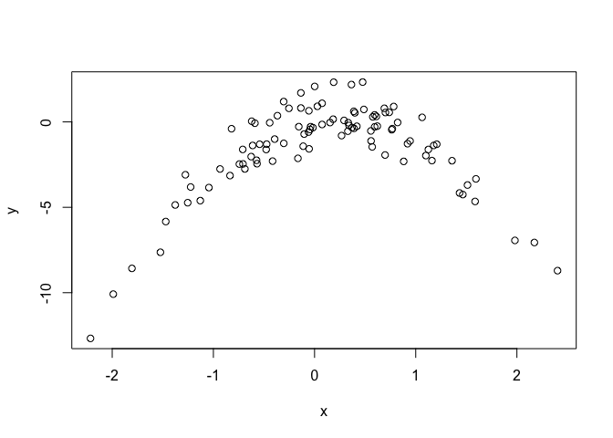

Untitled
================

``` r
library(ISLR)
library(boot)
library(ISLR2)
```

    ## 
    ## Attaching package: 'ISLR2'

    ## The following objects are masked from 'package:ISLR':
    ## 
    ##     Auto, Credit

# Question 5

> In Chapter 4, we used logistic regression to predict the probability
> of `default` using `income` and `balance` on the `Default` data set.
> We will now estimate the test error of this logistic regression model
> using the validation set approach. Do not forget to set a random seed
> before beginning your analysis.

``` r
set.seed(990215)
```

> 1.  Fit a logistic regression model that uses `income` and `balance`
>     to predict `default`.

``` r
log_model <- glm(default ~ income + balance,
                 data = Default,
                 family = "binomial")
```

> 2.  Using the validation set approach, estimate the test error of this
>     model. In order to do this, you must perform the following steps:
>
>     1.  Split the sample set into a training set and a validation set.

``` r
obs <- nrow(Default)
train <- sample(obs, obs/2)
```

> 2.  Fit a multiple logistic regression model using only the training
>     observations.

``` r
log_model_cv <- glm(default ~ income + balance,
                 data = Default,
                 family = "binomial",
                 subset = train)
```

> 3.  Obtain a prediction of default status for each individual in the
>     validation set by computing the posterior probability of default
>     for that individual, and classifying the individual to the
>     `default` category if the posterior probability is greater than
>     0.5.

``` r
probs <- predict(log_model_cv, newdata = Default[-train,], type = "response")
preds <- ifelse(probs > .5, "Yes", "No")
```

> 4.  Compute the validation set error, which is the fraction of the
>     observations in the validation set that are misclassified.

``` r
mean(preds != Default$default)
```

    ## [1] 0.0449

> 3.  Repeat the process in (b) three times, using three different
>     splits of the observations into a training set and a validation
>     set. Comment on the results obtained.

``` r
result <- c()
for (i in 1:3) {
    train <- sample(obs, obs / 2)
    log_model_cv <- glm(
        default ~ income + balance,
        data = Default,
        family = "binomial",
        subset = train
    )
    preds <-
        ifelse(predict(log_model_cv,
                       newdata = Default[-train, ],
                       type = "response") > 0.5,
               "Yes",
               "No")
    result <- c(result, mean(preds != Default$default[-train]))
}
result
```

    ## [1] 0.0270 0.0256 0.0258

> 4.  Now consider a logistic regression model that predicts the
>     probability of `default` using `income`, `balance`, and a dummy
>     variable for `student`. Estimate the test error for this model
>     using the validation set approach. Comment on whether or not
>     including a dummy variable for `student` leads to a reduction in
>     the test error rate.

Appears to be no significant difference in including `student`.

``` r
train <- sample(obs, obs / 2)
log_model_cv <- glm(
    default ~ income + balance + student,
    data = Default,
    family = "binomial",
    subset = train
)
preds <-
    ifelse(predict(log_model_cv,
                   newdata = Default[-train,],
                   type = "response") > 0.5,
           "Yes",
           "No")
mean(preds != Default$default[-train])
```

    ## [1] 0.0248

# Question 6

> We continue to consider the use of a logistic regression model to
> predict the probability of `default` using `income` and `balance` on
> the `Default` data set. In particular, we will now compute estimates
> for the standard errors of the `income` and `balance` logistic
> regression coefficients in two different ways: (1) using the
> bootstrap, and (2) using the standard formula for computing the
> standard errors in the `glm()` function. Do not forget to set a random
> seed before beginning your analysis.

> 1.  Using the `summary()` and `glm()` functions, determine the
>     estimated standard errors for the coefficients associated with
>     `income` and `balance` in a multiple logistic regression model
>     that uses both predictors.

``` r
set.seed(021599)
model <- glm(
    default ~ income + balance,
    data = Default,
    family = "binomial"
)
summary(model)$coef
```

    ##                  Estimate   Std. Error    z value      Pr(>|z|)
    ## (Intercept) -1.154047e+01 4.347564e-01 -26.544680 2.958355e-155
    ## income       2.080898e-05 4.985167e-06   4.174178  2.990638e-05
    ## balance      5.647103e-03 2.273731e-04  24.836280 3.638120e-136

> 2.  Write a function, `boot.fn()`, that takes as input the `Default`
>     data set as well as an index of the observations, and that outputs
>     the coefficient estimates for `income` and `balance` in the
>     multiple logistic regression model.

``` r
boot.fn <- function(Default, index) {
    model <- glm(default ~ income + balance,
                 data = Default[index,],
                 family = "binomial")
    summary(model)$coef[,1]
}
```

> 3.  Use the `boot()` function together with your `boot.fn()` function
>     to estimate the standard errors of the logistic regression
>     coefficients for income and balance.

``` r
boot(Default, boot.fn, 1000)
```

    ## 
    ## ORDINARY NONPARAMETRIC BOOTSTRAP
    ## 
    ## 
    ## Call:
    ## boot(data = Default, statistic = boot.fn, R = 1000)
    ## 
    ## 
    ## Bootstrap Statistics :
    ##          original        bias     std. error
    ## t1* -1.154047e+01 -3.558876e-02 4.144402e-01
    ## t2*  2.080898e-05 -7.469394e-08 4.836891e-06
    ## t3*  5.647103e-03  2.219002e-05 2.173261e-04

> 4.  Comment on the estimated standard errors obtained using the
>     `glm()` function and using your bootstrap function.

Very similar results

# Question 7

> In Sections 5.3.2 and 5.3.3, we saw that the `cv.glm()` function can
> be used in order to compute the LOOCV test error estimate.
> Alternatively, one could compute those quantities using just the
> `glm()` and `predict.glm()` functions, and a for loop. You will now
> take this approach in order to compute the LOOCV error for a simple
> logistic regression model on the `Weekly` data set. Recall that in the
> context of classification problems, the LOOCV error is given in (5.4).

> 1.  Fit a logistic regression model that predicts `Direction` using
>     `Lag1` and `Lag2`.

``` r
model <- glm(Direction ~ Lag1 + Lag2, data = Weekly, family = "binomial")
```

> 2.  Fit a logistic regression model that predicts `Direction` using
>     `Lag1` and `Lag2` *using all but the first observation*.

``` r
model_loo <-
    glm(Direction ~ Lag1 + Lag2, data = Weekly[-1, ], family = "binomial")
```

> 3.  Use the model from (b) to predict the direction of the first
>     observation. You can do this by predicting that the first
>     observation will go up if
>     $P($`Direction="Up" | Lag1 , Lag2`$) > 0.5$. Was this observation
>     correctly classified?

It was correct.

``` r
predict(model_loo, newdata = Weekly[1, ], type = "response")
```

    ##         1 
    ## 0.5713923

> 4.  Write a for loop from $i = 1$ to $i = n$, where $n$ is the number
>     of observations in the data set, that performs each of the
>     following steps:
>     1.  Fit a logistic regression model using all but the $i$th
>         observation to predict `Direction` using `Lag1` and `Lag2` .
>     2.  Compute the posterior probability of the market moving up for
>         the $i$th observation.
>     3.  Use the posterior probability for the $i$th observation in
>         order to predict whether or not the market moves up.
>     4.  Determine whether or not an error was made in predicting the
>         direction for the $i$th observation. If an error was made,
>         then indicate this as a 1, and otherwise indicate it as a 0.

``` r
n <- nrow(Weekly)
res <- c()
for (i in 1:n) {
    fit <- glm(Direction ~ Lag1 + Lag2,
               data =  Weekly[-i, ],
               family = "binomial")
    prob <- predict(fit, newdata = Weekly[i,], type = "response")
    pred <- ifelse(prob > .5, "Up", "Down")
    res <- c(res, as.numeric(pred == Weekly[i,]$Direction))
}
```

> 5.  Take the average of the $n$ numbers obtained in (d) in order to
>     obtain the LOOCV estimate for the test error. Comment on the
>     results.

We are correct 55% of the time. Which is not much better than a random
walk.

``` r
mean(res)
```

    ## [1] 0.5500459

# Question 8

> We will now perform cross-validation on a simulated data set.

> 1.  Generate a simulated data set as follows:
>
>     ``` r
>     > set.seed(1)
>     > x <- rnorm(100)
>     > y <- x - 2 *x^2 + rnorm(100)
>     ```
>
>     In this data set, what is $n$ and what is $p$? Write out the model
>     used to generate the data in equation form.

``` r
set.seed(1)
x <- rnorm(100)
y <- x - 2 *x^2 + rnorm(100)
```

$$
n = 100 \\
p = 1 \\
Y = X - 2X^2 + \epsilon
$$

> 2.  Create a scatterplot of $X$ against $Y$. Comment on what you find.

Non-linear. Looks quadratic.

``` r
plot(y~x)
```

<!-- -->

> 3.  Set a random seed, and then compute the LOOCV errors that result
>     from fitting the following four models using least squares:
>     1.  $Y = \beta_0 + \beta_1 X + \epsilon$
>     2.  $Y = \beta_0 + \beta_1 X + \beta_2 X^2 + \epsilon$
>     3.  $Y = \beta_0 + \beta_1 X + \beta_2 X^2 + \beta_3 X^3 + \epsilon$
>     4.  $Y = \beta_0 + \beta_1 X + \beta_2 X^2 + \beta_3 X^3 + \beta_4 X^4 + \epsilon$.
>
>     Note you may find it helpful to use the `data.frame()` function to
>     create a single data set containing both $X$ and $Y$.

``` r
set.seed(029915)
cv_error <- rep(0, 4)
df <- data.frame(y, x)
for (i in 1:4) {
    fit <- glm(y ~ poly(x, i), data = df)
    cv_error[i] <- cv.glm(df, fit)$delta[1]
}
cv_error
```

    ## [1] 7.2881616 0.9374236 0.9566218 0.9539049

> 4.  Repeat (c) using another random seed, and report your results. Are
>     your results the same as what you got in (c)? Why?

Same. Because we the same “folds” (all of the observations) will be
included in both cv-process.

``` r
set.seed(1999)
cv_error <- rep(0, 4)
df <- data.frame(y, x)
for (i in 1:4) {
    fit <- glm(y ~ poly(x, i), data = df)
    cv_error[i] <- cv.glm(df, fit)$delta[1]
}
cv_error
```

    ## [1] 7.2881616 0.9374236 0.9566218 0.9539049

> 5.  Which of the models in (c) had the smallest LOOCV error? Is this
>     what you expected? Explain your answer.

The 2-degree polynomial. It was expected both given the visualization
and knowing the actual formula for the data.

> 6.  Comment on the statistical significance of the coefficient
>     estimates that results from fitting each of the models in (c)
>     using least squares. Do these results agree with the conclusions
>     drawn based on the cross-validation results?

It is in line with our previous observaitons.

``` r
summary(glm(y ~ poly(x, 1), data = df))$coef
```

    ##              Estimate Std. Error   t value     Pr(>|t|)
    ## (Intercept) -1.550023  0.2600138 -5.961308 3.953542e-08
    ## poly(x, 1)   6.188826  2.6001382  2.380191 1.923846e-02

``` r
summary(glm(y ~ poly(x, 2), data = df))$coef
```

    ##               Estimate Std. Error    t value     Pr(>|t|)
    ## (Intercept)  -1.550023 0.09580323 -16.179231 2.656229e-29
    ## poly(x, 2)1   6.188826 0.95803228   6.459934 4.184810e-09
    ## poly(x, 2)2 -23.948305 0.95803228 -24.997388 4.584330e-44

``` r
summary(glm(y ~ poly(x, 3), data = df))$coef
```

    ##                Estimate Std. Error    t value     Pr(>|t|)
    ## (Intercept)  -1.5500226 0.09626318 -16.101926 4.995066e-29
    ## poly(x, 3)1   6.1888256 0.96263178   6.429068 4.971565e-09
    ## poly(x, 3)2 -23.9483049 0.96263178 -24.877950 1.216703e-43
    ## poly(x, 3)3   0.2641057 0.96263178   0.274358 7.843990e-01

``` r
summary(glm(y ~ poly(x, 4), data = df))$coef
```

    ##                Estimate Std. Error     t value     Pr(>|t|)
    ## (Intercept)  -1.5500226 0.09590514 -16.1620379 5.169227e-29
    ## poly(x, 4)1   6.1888256 0.95905143   6.4530695 4.590732e-09
    ## poly(x, 4)2 -23.9483049 0.95905143 -24.9708243 1.593826e-43
    ## poly(x, 4)3   0.2641057 0.95905143   0.2753822 7.836207e-01
    ## poly(x, 4)4   1.2570950 0.95905143   1.3107691 1.930956e-01

# Question 9

> We will now consider the `Boston` housing data set, from the `ISLR2`
> library.

> 1.  Based on this data set, provide an estimate for the population
>     mean of `medv`. Call this estimate $\hat\mu$.

``` r
mean(Boston$medv)
```

    ## [1] 22.53281

> 2.  Provide an estimate of the standard error of $\hat\mu$. Interpret
>     this result.
>
> *Hint: We can compute the standard error of the sample mean by
> dividing the sample standard deviation by the square root of the
> number of observations.*

``` r
sd(Boston$medv) / sqrt(nrow(Boston))
```

    ## [1] 0.4088611

> 3.  Now estimate the standard error of $\hat\mu$ using the bootstrap.
>     How does this compare to your answer from (b)?

Very similar result.

``` r
boot.fn <- function(data, i) {
    boot_sample <- sample(Boston$medv, nrow(Boston), replace = T)
    mean(boot_sample)
}
b <- boot(Boston$medv, boot.fn, R = 1000)
b
```

    ## 
    ## ORDINARY NONPARAMETRIC BOOTSTRAP
    ## 
    ## 
    ## Call:
    ## boot(data = Boston$medv, statistic = boot.fn, R = 1000)
    ## 
    ## 
    ## Bootstrap Statistics :
    ##     original     bias    std. error
    ## t1* 23.46403 -0.9391103   0.3984937

> 4.  Based on your bootstrap estimate from (c), provide a 95%
>     confidence interval for the mean of `medv`. Compare it to the
>     results obtained using `t.test(Boston$medv)`.
>
> *Hint: You can approximate a 95% confidence interval using the formula
> $[\hat\mu - 2SE(\hat\mu), \hat\mu + 2SE(\hat\mu)].$*

``` r
b$t0 - 2*0.405298
```

    ## [1] 22.65344

``` r
b$t0 + 2*0.405298
```

    ## [1] 24.27463

``` r
t.test(Boston$medv)
```

    ## 
    ##  One Sample t-test
    ## 
    ## data:  Boston$medv
    ## t = 55.111, df = 505, p-value < 2.2e-16
    ## alternative hypothesis: true mean is not equal to 0
    ## 95 percent confidence interval:
    ##  21.72953 23.33608
    ## sample estimates:
    ## mean of x 
    ##  22.53281

> 5.  Based on this data set, provide an estimate, $\hat\mu_{med}$, for
>     the median value of `medv` in the population.

``` r
median(Boston$medv)
```

    ## [1] 21.2

> 6.  We now would like to estimate the standard error of
>     $\hat\mu_{med}$. Unfortunately, there is no simple formula for
>     computing the standard error of the median. Instead, estimate the
>     standard error of the median using the bootstrap. Comment on your
>     findings.

The estimated s.e. of the median is lower than the estimated s.e. of the
mean.

``` r
boot.fn <- function(data, i) {
    boot_sample <- sample(data$medv, nrow(data), replace = T)
    median(boot_sample)
}
boot(Boston, boot.fn, R= 1000)
```

    ## 
    ## ORDINARY NONPARAMETRIC BOOTSTRAP
    ## 
    ## 
    ## Call:
    ## boot(data = Boston, statistic = boot.fn, R = 1000)
    ## 
    ## 
    ## Bootstrap Statistics :
    ##     original  bias    std. error
    ## t1*    21.55 -0.3708    0.379976

> 7.  Based on this data set, provide an estimate for the tenth
>     percentile of `medv` in Boston census tracts. Call this quantity
>     $\hat\mu_{0.1}$. (You can use the `quantile()` function.)

``` r
quantile(Boston$medv, 0.1)
```

    ##   10% 
    ## 12.75

> 8.  Use the bootstrap to estimate the standard error of
>     $\hat\mu_{0.1}$. Comment on your findings.

The standard error is the highest among all the other estimated
quantities.

``` r
boot.fn <- function(data, x) {
    boot_sample <- sample(data$medv, nrow(data), replace = T)
    quantile(boot_sample, .1)
}
boot(Boston, boot.fn, R=1000)
```

    ## 
    ## ORDINARY NONPARAMETRIC BOOTSTRAP
    ## 
    ## 
    ## Call:
    ## boot(data = Boston, statistic = boot.fn, R = 1000)
    ## 
    ## 
    ## Bootstrap Statistics :
    ##     original  bias    std. error
    ## t1*     12.6  0.1732   0.5078087
